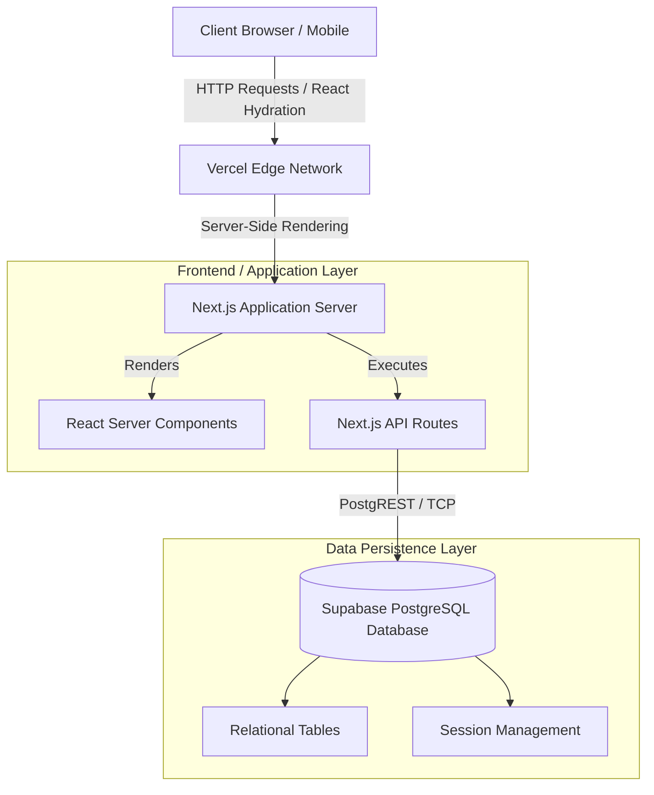
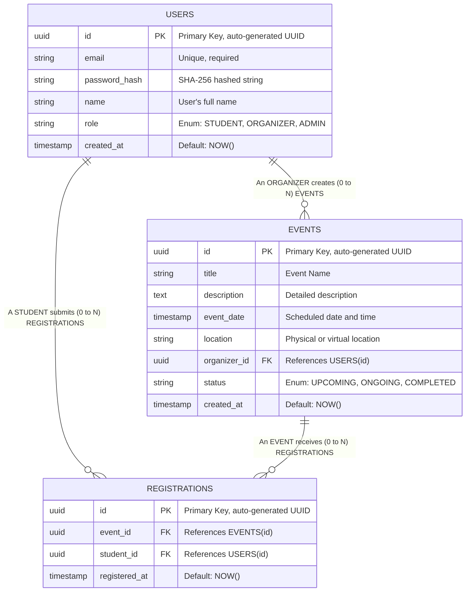
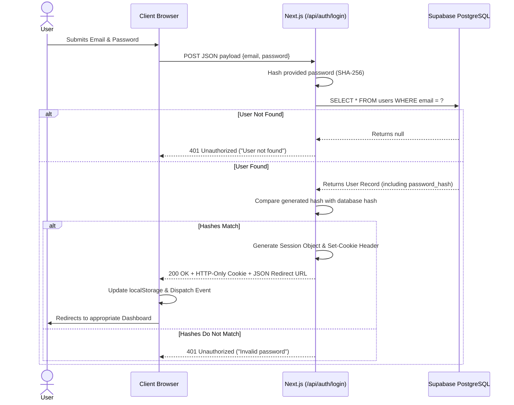
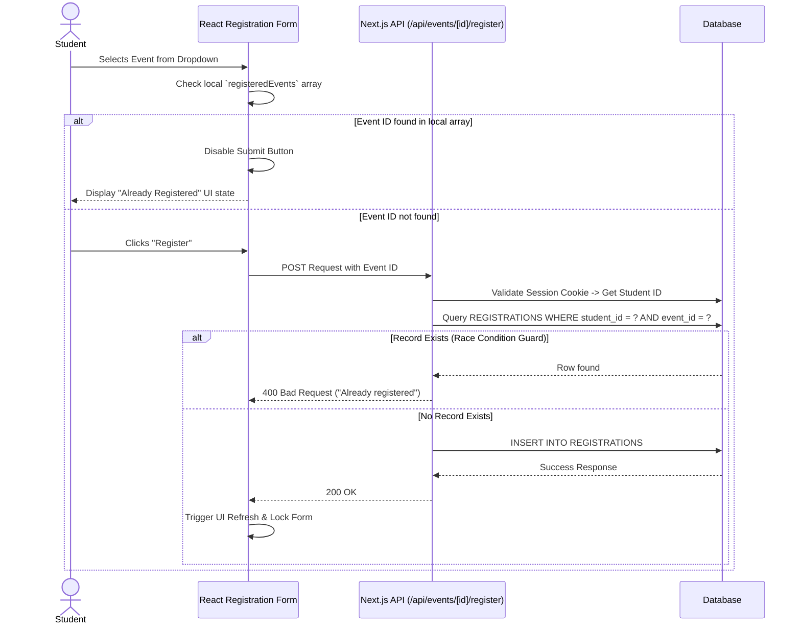

# System Architecture & Technical Design

This document details the architectural decisions, structural layers, and data flow mechanisms that power the Campus Event Hub (CEH). It is designed to provide software engineers and system architects with a deep understanding of how the platform operates under the hood.

---

## 1. High-Level System Architecture

The CEH platform adopts a decoupled, modern web architecture centered around the Next.js App Router framework. This architecture bridges the gap between traditional Single Page Applications (SPAs) and classic Server-Rendered applications by moving heavy lifting to the server while maintaining a highly interactive client experience.

### 1.1 Layer Descriptions
1. **Presentation Layer (React Server Components):** Utilizes Next.js Server Components to render HTML on the server before sending it to the client. This reduces the JavaScript bundle size sent to the browser, improving performance and SEO.
2. **Application Logic Layer (API Routes):** Instead of a separate Express.js or Python backend, the backend logic is co-located within the Next.js `src/app/api` directory. These serverless functions handle form submissions, session validation, and business logic (like checking for duplicate registrations).
3. **Data Layer (Supabase/PostgreSQL):** A fully managed PostgreSQL database handles persistent storage. It provides strict relational integrity through foreign keys and constraints.

---

## 2. Database Design & Entity-Relationship Model

The data layer is rigorously structured to ensure normalization (Third Normal Form - 3NF) where possible, eliminating redundant data and ensuring referential integrity.

### 2.1 Entity Relationship (ER) Diagram

### 2.2 Schema Implementation Notes
- **UUIDs:** Universally Unique Identifiers are used as primary keys instead of auto-incrementing integers to prevent ID-guessing attacks and facilitate easier data merging if the system becomes distributed.
- **Foreign Key Constraints:** `event_id` and `student_id` in the `REGISTRATIONS` table strictly reference their parent tables. Attempting to register a non-existent student or for a deleted event will result in a database-level rejection.

---

## 3. Critical System Workflows

Understanding the flow of data during critical operations is essential for debugging and future feature expansion.

### 3.1 Authentication Workflow (Login)
The authentication system relies on custom session management rather than external OAuth providers, ensuring total data sovereignty.

### 3.2 Safe Registration Workflow (Duplicate Prevention)
The core business logic of the student portal ensures data integrity by preventing a single student from registering for the same event multiple times.

